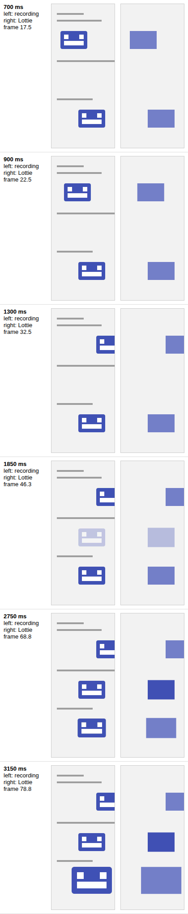

# blueprint

Command-line tool with two commands:

- `blueprint apk` turns an Android APK into a machine-readable blueprint of its UI: screens,
  navigation between them, and layout wireframes. It decompiles the APK with
  [jadx](https://github.com/skylot/jadx) (used as a library); nothing is executed.
- `blueprint motion` measures UI motion in a video and writes it as a motion spec, Jetpack Compose
  code and a Lottie animation. See [motion](#motion).

## Usage

```sh
./gradlew installDist
build/install/blueprint/bin/blueprint apk path/to/app.apk [-o out-dir]
build/install/blueprint/bin/blueprint motion path/to/recording.mp4 [-o out-dir] [--px-per-dp 2.625] [--package com.example.motion]
```

On Linux, `motion` needs the GTK 2 runtime (`libgtk2.0-0t64` on Ubuntu 24.04): the OpenCV
optical-flow natives link against it even though nothing is displayed.

## apk

Writes to `out-dir` (default `./<apk name>-blueprint`):

| File | Contents |
|---|---|
| `blueprint.json` | The blueprint (schema below). |
| `navigation.mmd` | [Mermaid](https://mermaid.js.org) flowchart of the navigation. Solid arrows are declared or direct, dashed arrows are inferred or unresolved, `?` is an unknown source. |

Only analyse APKs you own or have the rights to.

### `blueprint.json` (schema version 1)

| Field | Description |
|---|---|
| `source` | APK file name and SHA-256. |
| `app` | Package, version, min/target SDK, label (from the manifest). |
| `ui.views` | App XML layouts were found. |
| `ui.compose` | Jetpack Compose libraries are bundled (not which screens use them). |
| `screens[]` | `id` (class name or route), `kind` (`activity`, `fragment`, `dialog`, `compose-route`), `launcher`, `label`, `layouts[]`. |
| `screens[].layouts[]` | `layout`, `how` it was bound, `evidence` (`class:line` or resource). The first entry is the main layout. |
| `navigation[]` | `from` (screen id, or absent when unknown), `to`, `via`, `confidence`, `evidence`. |
| `navGraphs[]` | Navigation component graphs as declared in `res/navigation`. |
| `layouts{}` | Layout name → wireframe tree: `type`, `role`, `id`, `text`/`hint`/`contentDescription` (resolved from `@string`), `src`, `width`, `height`, `orientation`, `visibility`, `include`, `fragment`, `navGraph`, `children`. |
| `warnings[]` | What the extraction could not cover. |

#### How things are found

- **Screens**: manifest activities; navigation-graph destinations; `*Fragment` classes that bind a
  layout or are instantiated by app code; fragments hosted in a screen's layout; Compose routes
  (Navigation 3 `NavKey` types, `composable("route")`, `composable<Route>`).
- **Layouts**: `setContentView(R.layout.x)`, view binding (including R8's
  `((Screen) x).getLayoutInflater().inflate(...)`), `super(R.layout.x)`, `inflate(R.layout.x)`.
  When nothing better is found, `activity_<name>` / `fragment_<name>` is matched by name and
  labelled `name-convention`.
- **Navigation**: navigation-graph actions, NavHost start destinations and hosted fragments from
  layouts, Intents to known activities, fragment instantiation, Compose route navigation.
- **Wireframe roles**: `container`, `scroll`, `text`, `button`, `fab`, `image`, `input`, `list`,
  `pager`, `toggle`, `chip`, `progress`, `slider`, `toolbar`, `navigation`, `card`, `web`,
  `divider`, `space`, `fragment-host`, `compose-host`, `include`, `view`, `custom`.

#### Confidence

| Value | Meaning |
|---|---|
| `declared` | Stated in a resource (navigation graph, layout). |
| `direct` | Found in the source screen's own code (including its R8 lambda classes). |
| `inferred` | Found in a helper class; the source comes from the Intent's context variable (jadx names it after its type, e.g. `mainActivity`) or from the only screen that uses the helper. R8 merges lambdas across classes, so treat it as a hint. |
| `unresolved` | Found in code, source screen unknown (`from` is absent). |

### Limits

- Screens built with Compose have no XML layouts, so they get no wireframe.
- Compose navigation usually runs in lambdas jadx moves out of the route's content, so the source
  route of a Compose edge is normally unknown; the hosting activity is noted in `evidence`.
- Code-based results depend on what survives R8 obfuscation; manifest activities and resource
  names are always recovered (jadx restores shortened resource paths).
- Known library classes and layouts (`androidx.*`, `abc_*`, `mtrl_*`, …) are excluded; see
  `apk/Libraries.kt`.

### Checked against

| APK (F-Droid) | Screens | Edges | Layouts |
|---|---|---|---|
| Tusky 32.2 (Views, R8) | 35 | 62 | 105 |
| Catima 2.45.0 | 16 | 17 | 39 |
| Read You 0.16.2 (Compose, Navigation 3) | 25 (22 routes) | 23 | 0 |

Tusky (7,080 classes) takes about 25 s on 4 cores.

## motion

Writes to `out-dir` (default `./<video name>-motion`):

| File | Contents |
|---|---|
| `motion.json` | The motion spec (schema below). |
| `Motion.kt` | One `@Composable <Element>Motion(play, modifier, content)` per element that replays the measured motion on any content through `graphicsLayer`. Distances are divided by `--px-per-dp` (default 1). |
| `motion.lottie.json` | Lottie (bodymovin 5.7.0) animation with one rectangle per element, in its measured colour, carrying its measured motion. The motion transfers, not the artwork. |

### How it works

1. Decode the video with JavaCV/FFmpeg using presentation timestamps (screen recordings often
   have variable frame rates) and downscale to at most 720 px for analysis.
2. Find **segments** (runs of frames with changed pixels) and, per segment, connected **areas**
   of changed pixels.
3. Per area, track corner features with pyramidal Lucas–Kanade optical flow. Points are kept if
   they move, return to their start when tracked backwards, and agree with the per-frame
   similarity transform; each transform is then refined against the first frame to remove drift.
   The result is kept only if warping the first frame explains the last (a fade does not).
   Rotation and scale are measured about their fixed point when it lies on the element.
4. Areas that change without moving are measured as **opacity** from their mean brightness.
5. Each changing property is fitted twice with Levenberg–Marquardt (start time and duration are
   free parameters): a cubic-Bézier and a damped spring (Compose units: `stiffness = ω²`). The
   spring is used only if its error is under 0.8× the Bézier's; both errors are recorded.

### `motion.json` (schema version 1)

| Field | Description |
|---|---|
| `source`, `video` | File name and SHA-256; size, fps, duration (ms), frame count. |
| `elements[]` | `id`, `bounds` and `pivot` (px, in the `reference` frame), mean `color`, `tracking` (`features` or `intensity`), `reference` (`start`, or `end` for elements that enter), `animations[]`. |
| `animations[]` | `property` (`translationX`/`translationY` px, `scale`, `rotation` degrees, `alpha`), `from`, `to`, `startMs`, `durationMs`, `easing` (`cubic-bezier` x1,y1,x2,y2 or `spring` dampingRatio, stiffness), `fit` (both RMS errors), `samples` (`[timeMs, value]` measured). |

### Checked against

Synthetic lossless clips with known motion (`MotionAnalyzerTest`):

| Motion | Recovered |
|---|---|
| Slide 160 px, `cubic-bezier(0.2, 0, 0, 1)`, 400 ms | 160 ± 1.5 px, start ± 12 ms, duration ± 25 ms, curve within 0.05 |
| Spring, damping 0.4, stiffness 300 | spring chosen, damping ± 0.08, stiffness ± 15 % |
| Scale 1 → 1.5 about the centre | 1.5 ± 0.03, no translation reported |
| Rotation 0 → 45° | 45 ± 1°, curve within 0.05 |
| Fade in, linear, 300 ms | opacity 0 → 1, duration ± 30 ms, curve within 0.05 |

A headless-Chromium screen recording (VP8, 25 fps) of three CSS transitions measured the slide as
160.0 px and the scale as 1.501; the measured samples follow the CSS curves within 0.03 for the
slide and scale and within 0.12 for the fade. Recording (left) against the generated Lottie
rendered by lottie-web (right):



### Limits

- One element per connected area: things that move together or overlap are measured as one.
- An element that moves *and* fades is measured as a move only.
- Elements entering from off-screen are tracked backwards from where they settle; points that
  leave the frame are lost.
- Bounds come from tracked corners, so they are approximate; colour is the region's mean.
- Low frame rates leave the end of an ease-out loosely constrained, so fitted durations can run
  long (the browser recording above: +22 ms to +70 ms).

## Development

```sh
./gradlew test
```
